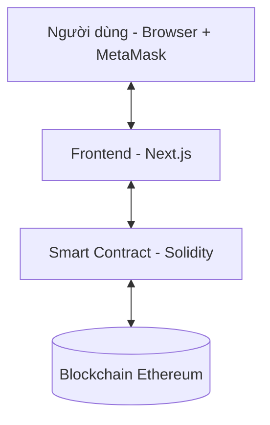

# Voting dApp - Group B

### Nhóm thực hiện (Group B)

| STT | Họ và tên |
| :--: | :---: |
| 1 | Nguyễn Uyên Khánh |
| 2 | Nguyễn Công Danh |
| 3 | Nguyễn Phước Tình |
| 4 | Lưu Mỹ Khánh |
| 5 | Nguyễn Tấn Phát |
| 6 | Huỳnh Hoài Nam |---

## Kiến trúc hệ thống

Hệ thống gồm 3 lớp giao tiếp với nhau:

- **Blockchain là Database:** Mọi dữ liệu (ứng viên, số phiếu, trạng thái đã vote) đều ở trên đó, không có server hay database truyền thống.
- **Tính phi tập trung:** Đảm bảo tính minh bạch và bảo mật cho quá trình bầu chọn.

---

## Luồng hoạt động

### 1. Khởi động ứng dụng
Khi người dùng mở web, Next.js thực hiện song song:
- **Đọc dữ liệu:** Lấy danh sách toàn bộ ứng viên và số phiếu hiện tại từ smart contract để hiển thị bảng kết quả.
- **Kiểm tra trạng thái:** Gọi `getVotingStatus()` để xác định giai đoạn: `NOT_STARTED`, `ACTIVE`, hoặc `ENDED`.
- **Lắng nghe sự kiện:** Bắt đầu lắng nghe `votedEvent` từ blockchain để tự cập nhật bảng và biểu đồ mà không cần reload trang.

### 2. Kết nối ví MetaMask
- Người dùng bấm **"Connect Wallet"** và xác nhận qua MetaMask.
- Frontend nhận được địa chỉ ví (dạng `0xAbc...123`).
- **Kiểm tra quyền:** Gọi vào contract để hỏi địa chỉ này đã vote chưa thông qua mapping `hasVoted` để ẩn/hiện nút Vote.

### 3. Quy trình bỏ phiếu
1. **Chọn ứng viên:** Người dùng chọn ứng viên từ danh sách thả xuống.
2. **Xác nhận giao dịch:** Bấm **Vote**, ký giao dịch và xác nhận phí gas qua MetaMask.
3. **Thực thi trên Contract:** Hàm `vote()` thực hiện các bước kiểm tra:
    - Người này chưa từng vote.
    - ID ứng viên hợp lệ.
    - Đang trong thời gian bầu cử.
4. **Cập nhật:** Tăng `voteCount`, đánh dấu `hasVoted` và phát ra `votedEvent`.

### 4. Xử lý lỗi
| Tình huống | Cách xử lý |
| :---: | :---: |
| **Từ chối giao dịch** | Hiển thị "Transaction rejected by user". |
| **Bầu chọn lần hai** | Contract revert với lý do "Ban da bo phieu roi". |
| **Ngoài khung giờ** | Contract revert với lý do từ modifier `withinVotingPeriod`. |
| **Hết phí Gas** | MetaMask cảnh báo hoặc hiển thị "Insufficient gas". |

### 5. Trang quản trị (Admin Panel)
Truy cập tại `/admin` (Chỉ dành cho Owner):
- **Thêm ứng viên:** Nhập tên -> `addCandidate()` -> Tự động cập nhật danh sách.
- **Cài đặt thời gian:** Chọn `startTime` và `endTime` -> Lưu giá trị timestamp vào contract.

### 6. Triển khai (Deployment)
1. Biên dịch và đẩy bytecode lên mạng **Sepolia**.
2. Nhận địa chỉ contract và cập nhật vào file `.env`.
3. Cấu hình ABI trong `frontend/lib/contract.ts`.

---

## Công nghệ sử dụng

- **Smart Contract:** Solidity 0.8.x
- **Framework:** Hardhat
- **Frontend:** Next.js (App Router) + Tailwind CSS
- **Web3 Library:** Ethers.js v6
- **Charts:** Chart.js
- **Wallet:** MetaMask

