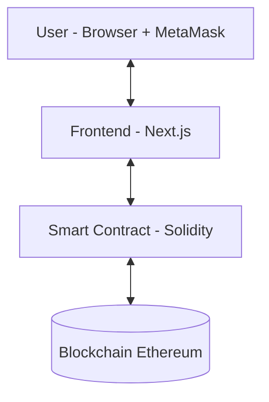

# Voting dApp - Group B

Decentralized voting application built on Ethereum.

---

## System Architecture

The system consists of three main layers:

- **Blockchain as Database:** All data (candidates, vote counts, voting status) is stored directly on the Smart Contract.
- **Decentralization:** No traditional server or database is used, ensuring transparency and security.

---

## Workflows

### 1. Application Initialization
When a user accesses the site, Next.js performs the following in parallel:
- **Data Retrieval:** Fetches the candidate list and vote counts from the Smart Contract.
- **Status Check:** Calls `getVotingStatus()` to determine the phase: `NOT_STARTED`, `ACTIVE`, or `ENDED`.
- **Event Listening:** Connects to `votedEvent` to update the UI (table & charts) in real-time without page reloads.

### 2. MetaMask Connection
- User clicks **"Connect Wallet"** and confirms via MetaMask.
- Frontend receives the wallet address (e.g., `0xAbc...123`).
- **Permission Check:** Calls the `hasVoted` mapping to show or hide the Vote button based on the wallet's history.

### 3. Voting Process
1. **Select Candidate:** User selects a candidate from the dropdown.
2. **Confirm Transaction:** User clicks **Vote**, then signs the transaction and pays the gas fee via MetaMask.
3. **Contract Execution:** The `vote()` function performs validation:
    - User has not voted before.
    - Candidate ID is valid.
    - Current time is within the voting period.
4. **Update:** Increments `voteCount`, marks `hasVoted`, and emits `votedEvent`.

### 4. Error Handling
| Situation | Handling |
| :--- | :--- |
| **Transaction Rejected** | Displays "Transaction rejected by user". |
| **Double Voting** | Contract reverts with "Ban da bo phieu roi". |
| **Outside Voting Period** | Blocked by the `withinVotingPeriod` modifier. |
| **Insufficient Gas** | MetaMask warning or "Insufficient gas" message. |

### 5. Admin Panel
Accessible at `/admin` (Owner only):
- **Add Candidate:** Enter name -> `addCandidate()` -> Automatic list update.
- **Set Voting Period:** Select `startTime` and `endTime` -> Saves timestamps to the Contract.

### 6. Deployment
1. Compile and deploy bytecode to the **Sepolia** network.
2. Update the contract address in the `.env` file.
3. Configure the ABI in `frontend/lib/contract.ts`.

---

## Tech Stack

- **Smart Contract:** Solidity 0.8.x
- **Framework:** Hardhat
- **Frontend:** Next.js (App Router) + Tailwind CSS
- **Web3 Library:** Ethers.js v6
- **Charts:** Chart.js
- **Wallet:** MetaMask

