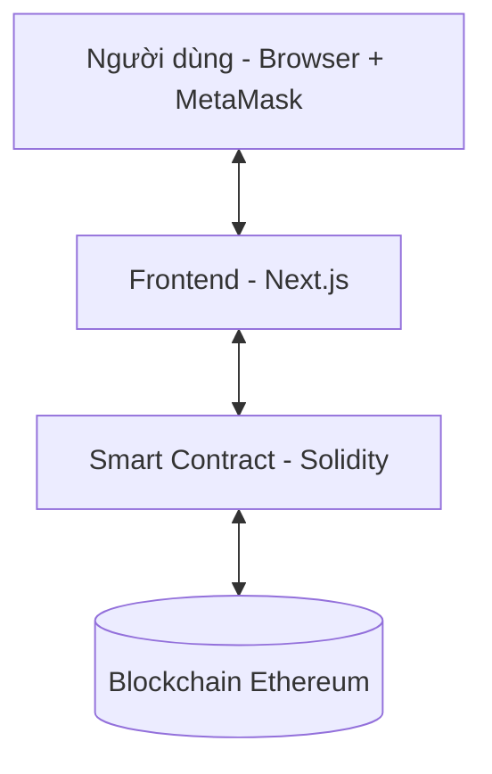

# Voting dApp - Group B

### Nhóm thực hiện (Group B)

| STT | Họ và tên |
| :--: | :---: |
| 1 | Nguyễn Uyên Khánh |
| 2 | Nguyễn Công Danh |
| 3 | Nguyễn Phước Tình |
| 4 | Lưu Mỹ Khánh |
| 5 | Nguyễn Tấn Phát |
| 6 | Huỳnh Hoài Nam |---

## Kiến trúc hệ thống

Hệ thống gồm 3 lớp giao tiếp với nhau:



- **Blockchain là Database:** Mọi dữ liệu (ứng viên, số phiếu, trạng thái đã vote) đều ở trên đó, không có server hay database truyền thống.
- **Tính phi tập trung:** Đảm bảo tính minh bạch và bảo mật cho quá trình bầu chọn.

---

## Cấu trúc dự án 
```
voting-dapp-GroupB/
├── .env.example                         (mẫu biến môi trường cho deploy testnet)
├── .gitignore
├── contracts/
│   └── Voting.sol
├── frontend/
│   ├── .env.local                       (địa chỉ contract local cho frontend)
│   ├── next.config.ts
│   ├── package.json
│   ├── postcss.config.js
│   ├── tsconfig.json
│   ├── app/
│   │   ├── global.css                  (CSS toàn cục)
│   │   ├── layout.tsx                  (Server Component, bọc tất cả các trang)
│   │   ├── page.tsx                    (giao diện người bầu)
│   │   └── admin/
│   │       └── page.tsx                (giao diện admin)
│   ├── components/
│   │   ├── Header.tsx                  (Client Component, hiển thị ví và navbar)
│   │   ├── CandidateTable.tsx          (bảng danh sách ứng viên)
│   │   ├── Providers.tsx               (wrapper context/provider phía client)
│   │   ├── VoteChart.tsx               (biểu đồ kết quả real-time)
│   │   ├── VotingStatus.tsx            (hiển thị trạng thái bầu cử)
│   │   └── ui/
│   │       ├── Spinner.tsx             (loading indicator)
│   │       └── Toast.tsx               (thông báo lỗi và thành công)
│   ├── lib/
│   │   ├── contract.ts                 (ABI và khởi tạo Ethers.js)
│   │   └── i18n.ts                     (hàm/chuỗi hỗ trợ đa ngôn ngữ)
│   ├── types/
│   │   └── ethereum.d.ts               (khai báo kiểu cho window.ethereum)
│   └── public/
├── hardhat.config.js
├── package.json
├── README.md
├── scripts/
│   └── deploy.js
├── test/
│   └── Voting.test.js
└── .env                                 (biến môi trường local, không commit)
```

---

## Luồng hoạt động

### 1. Khởi động ứng dụng
Khi người dùng mở web, Next.js thực hiện song song:
- **Đọc dữ liệu:** Lấy danh sách toàn bộ ứng viên và số phiếu hiện tại từ smart contract để hiển thị bảng kết quả.
- **Kiểm tra trạng thái:** Gọi `getVotingStatus()` để xác định giai đoạn: `NOT_STARTED`, `ACTIVE`, hoặc `ENDED`.
- **Lắng nghe sự kiện:** Bắt đầu lắng nghe `votedEvent` từ blockchain để tự cập nhật bảng và biểu đồ mà không cần reload trang.

### 2. Kết nối ví MetaMask
- Người dùng bấm **"Connect Wallet"** và xác nhận qua MetaMask.
- Frontend nhận được địa chỉ ví (dạng `0xAbc...123`).
- **Kiểm tra quyền:** Gọi vào contract để hỏi địa chỉ này đã vote chưa thông qua mapping `hasVoted` để ẩn/hiện nút Vote.

### 3. Quy trình bỏ phiếu
1. **Chọn ứng viên:** Người dùng chọn ứng viên từ danh sách thả xuống.
2. **Xác nhận giao dịch:** Bấm **Vote**, ký giao dịch và xác nhận phí gas qua MetaMask.
3. **Thực thi trên Contract:** Hàm `vote()` thực hiện các bước kiểm tra:
    - Người này chưa từng vote.
    - ID ứng viên hợp lệ.
    - Đang trong thời gian bầu cử.
4. **Cập nhật:** Tăng `voteCount`, đánh dấu `hasVoted` và phát ra `votedEvent`.

### 4. Xử lý lỗi
| Tình huống | Cách xử lý |
| :---: | :---: |
| **Từ chối giao dịch** | Hiển thị "Transaction rejected by user". |
| **Bầu chọn lần hai** | Contract revert với lý do "You have already voted". |
| **Ngoài khung giờ** | Contract revert với lý do từ modifier `withinVotingPeriod`. |
| **Hết phí Gas** | MetaMask cảnh báo hoặc hiển thị "Insufficient gas". |

### 5. Trang quản trị (Admin Panel)
Truy cập tại `/admin` (Chỉ dành cho Owner):
- **Thêm ứng viên:** Nhập tên -> `addCandidate()` -> Tự động cập nhật danh sách.
- **Cài đặt thời gian:** Chọn `startTime` và `endTime` -> Lưu giá trị timestamp vào contract.

### 6. Triển khai (Deployment)
1. Biên dịch và đẩy bytecode lên mạng **Sepolia**.
2. Nhận địa chỉ contract và cập nhật vào file `.env`.
3. Cấu hình ABI trong `frontend/lib/contract.ts`.

### 7. Hướng dẫn deploy và test trên Local (Hardhat)

#### Yêu cầu trước khi chạy
- Đã cài **Node.js 18+** và **npm**.
- Đã cài **MetaMask** trên trình duyệt.
- Đang đứng ở thư mục gốc `voting-dapp-GroupB`.

#### Bước 1: Cài dependencies
Chạy lần lượt:
```bash
npm install
cd frontend
npm install
cd ..
```

#### Bước 2: Khởi chạy blockchain local
Mở terminal #1:
```bash
npx hardhat node
```
Kỳ vọng thấy RPC chạy tại `http://127.0.0.1:8545` (Chain ID `31337`).

#### Bước 3: Deploy contract lên localhost
Mở terminal #2:
```bash
npx hardhat run scripts/deploy.js --network localhost
```
Sau khi chạy xong, copy địa chỉ từ output:
`Voting contract deployed to: 0x...`

#### Bước 4: Cấu hình địa chỉ contract cho frontend
Tạo hoặc cập nhật file `frontend/.env.local`:
```env
NEXT_PUBLIC_CONTRACT_ADDRESS=0xDIA_CHI_VUA_DEPLOY
```

#### Bước 5: Chạy frontend
Mở terminal #3:
```bash
cd frontend
npm run dev
```
Truy cập: `http://localhost:3000`

#### Bước 6: Cấu hình MetaMask mạng local
Trong MetaMask, thêm/chuyển sang mạng:
- **Network Name:** Hardhat Local
- **RPC URL:** `http://127.0.0.1:8545`
- **Chain ID:** `31337`
- **Currency Symbol:** ETH

Import một private key test được in ra từ terminal chạy `npx hardhat node`.

#### Bước 7: Test nhanh bằng tay trên giao diện
1. Vào `/admin` để kiểm tra quyền owner và thao tác quản trị.
2. Thêm/cập nhật/xóa ứng viên (nếu chức năng đang bật).
3. Vào `/` để bỏ phiếu bằng tài khoản voter.
4. Xác nhận:
   - Số phiếu tăng đúng theo ứng viên đã chọn.
   - Không thể vote lần 2 bằng cùng một ví.
   - UI tự cập nhật sau khi giao dịch được xác nhận.

#### Bước 8: Chạy test smart contract
Tại thư mục gốc:
```bash
npm test
```
Lệnh này chạy toàn bộ test trong `test/Voting.test.js`.

#### Các lỗi thường gặp
- **Wrong network (chainId không phải 31337):** chuyển MetaMask sang Hardhat Local.
- **`EADDRINUSE 127.0.0.1:8545`:** cổng đã có tiến trình Hardhat khác chạy.
- **Sai địa chỉ contract trên UI:** deploy lại và cập nhật `frontend/.env.local`, sau đó restart frontend.
- **`Another next dev server is already running`:** tắt tiến trình Next.js cũ rồi chạy lại.

> **Lưu ý quan trọng:** Mỗi lần restart Hardhat node, trạng thái chain bị reset. Bạn phải deploy lại contract, cập nhật địa chỉ mới trong `.env.local`, rồi khởi động lại frontend.

---

## Công nghệ sử dụng

- **Smart Contract:** Solidity 0.8.28
- **Framework:** Hardhat 2.28.6 
- **Frontend:** Next.js (App Router) + Tailwind CSS 4.2.4
- **Web3 Library:** Ethers.js v6
- **Charts:** Chart.js
- **Wallet:** MetaMask

